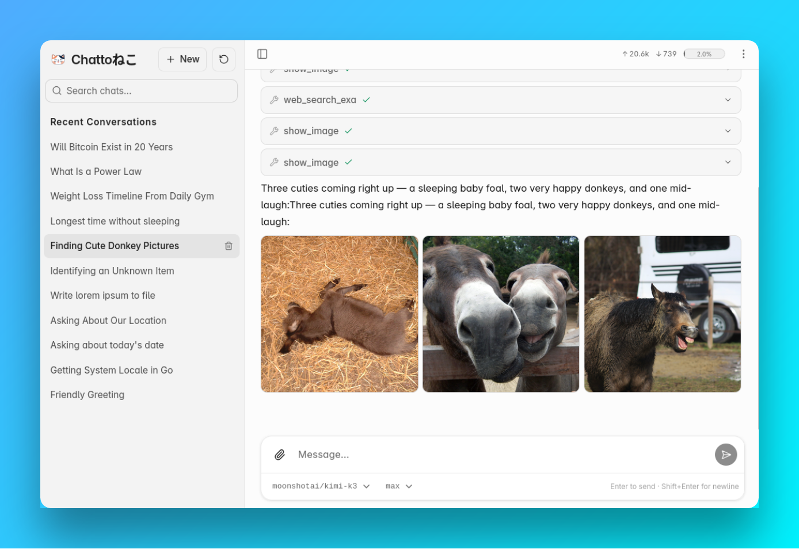

# ChattoNeko



Your own cute cat AI assistant, self-hosted.

"Chatto" is a humorous mimicry of the Japanese pronunciation of the English word "chat", "neko" is Japanese for cat. ChattoNeko is a chat application for large language models that you run on your own machine. It is made for personal self-hosted use, not a SaaS product: no accounts, no multi-tenancy, no billing.

It is extremely small. Everything is one static Go binary with the web UI embedded, about 8 MB after UPX packing. The Docker image is about 15 MB. Small as it is, it has what you expect from a chat app: streaming, reasoning display, attachments, tools, history, search, per-chat settings, optional login.

## What it does

- Chat with any model through an OpenAI-compatible (chat completions) API. Keep a list of favorites and switch per chat.
- Replies stream in as they are written, and can be stopped at any time.
- Models that reason out loud show their thinking in a collapsible block.
- Send images and text files as attachments.
- Vision for text-only models: a separate vision model describes the image for them.
- Tools the model can call, plus any MCP server you add.
- The model can hand you files back as download links, and show images inline.
- Chats are saved and titled automatically; search, rename, delete.
- Regenerate a reply, or edit an earlier message and take the conversation elsewhere.
- Each chat remembers its own model, reasoning effort and tools.
- Optional single-user login.
- A plain JSON API you can script against.

## How it is put together

One program plays three parts:

- an API server (REST plus SSE for streaming),
- a web client, the embedded SPA served at `/`,
- and the same web client wrapped with Capacitor into an Android app that talks to any ChattoNeko server over the network. Point it at your server address and you have a mobile client for the same instance, same history.

Everything the server keeps — configuration, chats, messages, attachments, model metadata — lives in a single SQLite database file. Backing up means copying that one file; moving servers means moving that one file.

## Run it

Docker, the easy way:

```bash
docker pull ghcr.io/tapir/chattoneko:latest
docker run -d --name chattoneko \
  -p 8080:8080 \
  -v chattoneko-data:/var/lib/chattoneko \
  ghcr.io/tapir/chattoneko
```

Then open http://localhost:8080.

From source. You need [Go](https://go.dev), [Node.js](https://nodejs.org), [sqlc](https://sqlc.dev) and optionally [UPX](https://upx.github.io):

```bash
git clone https://github.com/tapir/chattoneko && cd chattoneko
make run          # builds the web UI, generates queries, packs the binary, starts it
```

`make build` alone leaves you with `./chattoneko`, which you can run from anywhere.

The Android APK is built with `make mobile-apk`.

## Configuration

There is no config file. On first start the database is seeded with defaults and the server comes up. All configuration happens after your first visit to the page: enter your provider's base URL and API key, pick your models, done. Settings are stored in the database and apply live, no restart needed.

If your provider is OpenRouter, a lot of this is automated. ChattoNeko reads the provider's `/models` endpoint, and OpenRouter reports everything it uses: context length, input and output modalities, supported reasoning efforts and the default effort. Pick a model and its capabilities are filled in for you, which is also how the app knows whether a model can see images. Other OpenAI-compatible providers report less; missing values fall back to sensible defaults and can be edited by hand.

### Environment variables

All optional. They are read once at startup.

| Variable | Meaning |
| --- | --- |
| `CHATTO_USERNAME` | Login name. Set both this and the password to require a sign-in; if either is missing there is no auth at all. |
| `CHATTO_PASSWORD` | Login password, used as-is. Nothing about the login is written to the database; changing it means restarting. |
| `CHATTO_LOCATION_STRING` | Free-form location, e.g. `Berlin, Germany`. Appended to the `time_location` tool result so agents know where you are. |

If auth is off and the listen address is not loopback-only, the server logs a warning that it is wide open on the network.

### Command line flags

| Flag | Default | Meaning |
| --- | --- | --- |
| `-db` | `chatto.db` next to the executable | SQLite database file |
| `-listen` | `:8080` | HTTP listen address, fixed for the lifetime of the process |
| `-debug` | off | Debug logging |

The Docker image runs `-db /var/lib/chattoneko/neko.db`, so a single volume at `/var/lib/chattoneko` covers all state. A bind mount works as well: the entrypoint fixes the directory ownership at start, then drops to uid/gid 1000.

## Tools

Four integrated tools, each toggleable per chat and globally in settings:

- `time_location` — the server's current date, time and timezone, plus your location when `CHATTO_LOCATION_STRING` is set. Lets the model ground "tomorrow", "next Friday" or "near me".
- `simple_code` — runs a small Lua snippet in a restricted sandbox and returns what it prints. Exact arithmetic and data wrangling instead of guessing. No file, network, environment or debug access, with an instruction budget and an output cap.
- `create_text_file` — writes a complete UTF-8 text file that shows up as a download link on the reply. Text only, no binary formats.
- `show_image` — fetches a direct image URL and displays it inline in the chat, so the model can show you a picture rather than paste a link.

Beyond those you can add MCP servers in settings, either a stdio command or an HTTP endpoint with optional headers. Their tools join the catalog as soon as you save, no restart, and are toggled like the built-in ones.

## Vision

Not every model can see. If your chat model's input modalities do not include images, set a separate vision model in settings. When an image arrives in such a chat, ChattoNeko asks the vision model for a detailed description, caches it on the attachment, and injects that description into the conversation. You still see the image; the text-only model gets an accurate account of it, once, and reuses it on every later regeneration.

With no vision model configured, images are passed to the chat model as-is, which works only if it accepts them.

## FAQ

**Why is there no built-in web search or page fetching?**

Because doing it reliably is extremely hard. Anti-bot detection sits in front of almost everything worth reading, and a server-side fetcher either gets blocked or turns into a full browser-impersonation project of its own. Exa.ai has a free tier that is a perfect fit for personal usage — add their MCP server and you have search and content retrieval without ChattoNeko carrying any of that complexity.

**Why no multi-user?**

It is small and meant for self-hosted personal use. Accounts, permissions, quotas and isolation are most of the complexity in a chat product and none of the benefit when the one user is you.

**What if I want my family to use it?**

Run one instance per person. The image is 15 MB and idles at almost nothing, so ten of them on a single commodity server is not a thought you need to have twice. Everybody gets a private instance with their own database, their own models and their own API key.

**Will there ever be image or video generation?**

Probably not. There is no standard API for it: OpenAI has one, no other provider implements it, and ChattoNeko only speaks OpenAI-compatible APIs. Keeping that single-provider contract is what keeps the whole thing simple.

**What about transcription and speech?**

That will probably happen, yes. Speech-to-text and text-to-speech have de facto standard shapes that many providers implement, unlike generation.

**iOS?**

Open for contributions. The mobile app is Capacitor plus a WebView around the same web UI, so an iOS build should not be much work. The blocker is hardware: no Mac and no iPhone here so I can't develop or test.

## Disclaimer

All cat pictures are from [magnific.com](https://magnific.com).
